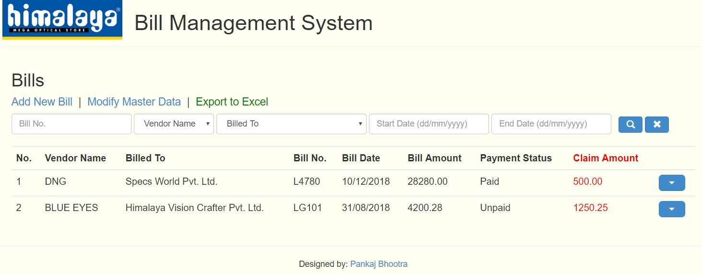

# Bill Management System

A Bill Manager App developed for Himalaya Optical company, using MEAN stack (MongoDB, ExpressJS, AngularJS, NodeJS). Also includes functions to generate PDF and Excel Reports.

Live demo link (test version with random data): https://himalaya-bms.herokuapp.com/#!/

## Setup

1. Install NodeJS ver.8.9.1+ and MongoDB ver.4.0.4+
2. `git clone https://github.com/PankajB1997/Bill_Management_System/`
3. Inside the root of the repository: `npm install`
4. Run `node server.js` to execute the app on localhost port 3000.

## Some Screenshots

1. Home Page

 

2. Add New Bill

 

3. Viewing Details of an Existing Bill

 

4. Adding Master Data to facilitate Bill Management

 
