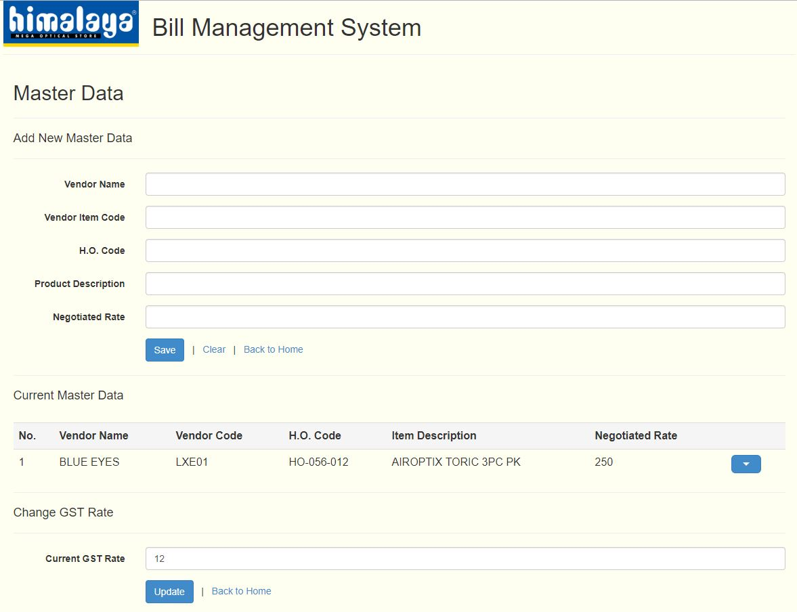

# Bill Management System

A Bill Manager App developed for Himalaya Optical company, using MEAN stack (MongoDB, ExpressJS, AngularJS, NodeJS).

Live demo available at: https://himalaya-bms.herokuapp.com/#!/

Some screenshots:

1. Home Page

 

2. Add New Bill

 

3. Viewing Details of an Existing Bill

 

4. Adding Master Data to facilitate Bill Management

 
